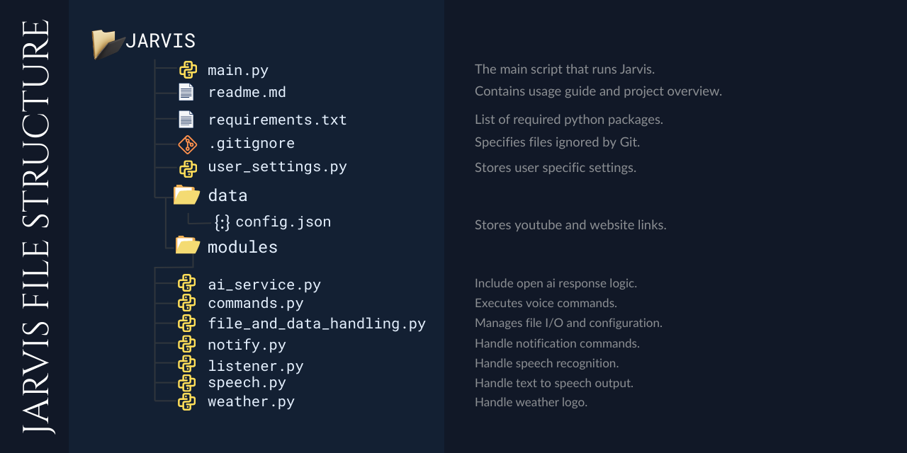

# JARVIS - Voice Assistant


## 📌 INTRODUCTION

Jarvis is a Python-based virtual assistant designed with a modular architecture for extensibility. It processes voice commands to execute system automation tasks—including web navigation, media playback, real-time weather updates, and intelligent conversational responses using the OpenAI API (requires an API key). Core functionality utilizes Google **Text-to-Speech (gTTS)** for clear audio feedback.

## TABLE OF CONTENT
1. [✨ FEATURES](#-features)
2. [⚙️ INSTALLATION](#️-installation)
3. [🔧 CONFIGURATION](#-configuration)
4. [🛠️ HOW TO USE](#️-how-to-use)
5. [📁 FILE & FOLDER STRUCTURE](#-file--folder-structure)
6. [🔒 PRIVACY NOTICE](#-privacy-notice)
7. [👤 AUTHOR AND CONTACT](#-author-and-contact)

## ✨ FEATURES
1. **🔗 Website Launcher**

   Say "open" followed by any of these:
   1. **POPULAR**
      - [google](https://google.com)
      - [youtube](https://youtube.com)
      - [wikipedia](https://www.wikipedia.org)
   2. **SHOPPING**
      - [amazon](https://amazon.com)
      - [flipkart](https://flipkart.com)
   3. **SOCIAL**
      - [facebook](https://facebook.com)
      - [linkedin](https://linkedin.com)
      - [instagram](https://instagram.com)
      - [twitter](https://twitter.com)
      - [github](https://github.com)
      - [reddit](https://www.reddit.com)
      - [discord](https://discord.com)
   4. **CODING**
      - [hackerrank](https://hackerrank.com)
      - [leetcode](https://leetcode.com)
   5. **AI**
      - [chatgpt](https://chat.openai.com)
      - [claude_ai](https://claude.ai)
      - [gemini](https://gemini.google.com)
   6. **ENTERTAINMENT**
      - [netflix](https://www.netflix.com)
      - [hotstar](https://www.hotstar.com)
      - [whatsapp](https://web.whatsapp.com)
      - [telegram](https://web.telegram.org)

    Add more sites in *"data/config.json"* file.

2. **🎵 Music/video Player**

   Say "play" followed by any of these:
   1. **ENGLISH SONGS**
      - [despacito](https://www.youtube.com/watch?v=kJQP7kiw5Fk)
      - [shape of you](https://www.youtube.com/watch?v=JGwWNGJdvx8)
      - [believer](https://www.youtube.com/watch?v=7wtfhZwyrcc)

   Add more songs/videos in *"data/config.json"*  file.

3. **🌦️ Weather Forecast** 

   - Live temperature & Wind speed
   - Visibility & Atmospheric pressure
   - Intelligent warnings (Rain, Thunderstorms, Fog)


4. **🧠 AI Assistant (*Optional*)**

   For general queries (e.g., *"What is coding?"*), Jarvis can use **OpenAI** to generate intelligent spoken responses. To enable this, add your API Key to `user_settings.py`.

5. **🔔 Notifications**

   Jarvis shows desktop notifications when it **starts**, **stops**, or **times out** due to inactivity.

6. **🕒 Auto Shutdown**

   To save resources, Jarvis automatically shuts down after a set period of inactivity (Default: *60 seconds*). You can change this duration in `user_settings.py`.

## ⚙️ INSTALLATION
### 🔧 TOOLS
1. [git](https://git-scm.com/install/windows)  
2. [vs code](https://code.visualstudio.com/Download)  
3. [python](https://www.python.org/downloads/)  

### 🎥 INSTALLATION VIDEO
(COMING SOON)

### 📥 Setup Steps

**Option 1: Using a Virtual Environment (Recommended)**
```bash
pip install virtualenv             # Install virtualenv tool
python -m venv env                 # Create a virtual environment
.\env\Scripts\activate             # Activate environment (Windows)
pip install -r requirements.txt    # Install dependencies
```
**Option 2: Without Virtual Environment**
```bash
pip install -r requirements.txt # Install required modules
 ```

## 🔧 CONFIGURATION

Before running Jarvis, open `user_settings.py` and update the preferences:

```python
OPENAI_API_KEY = "Enter your OpenAI API key"   # Optional (Leave blank if not used)
LOCATION_FOR_WEATHER = "Kolkata"               # Set your city (e.g., "Mumbai", "London")
DURATION_OF_TIMEOUT = 60                       # Auto-shutdown time in seconds
```

## 🛠️ HOW TO USE

- **Activate:** Say *"Jarvis"*.

- **Open Websites:**
  - Say *"Open [Website Name]"* to open the site directly.
  - If the site is not predefined, Jarvis will perform a **Google search**.

- **Google Search:** Say *"Search [Query]"* for a **Google search**.

- **Play Music/Video:** - Say *"Play [Song/Video Name]"* to play the song or video from **YouTube**. 
  - If not predefined, Jarvis will play the **top result** from a YouTube search.

- **Weather Report:** - Say *"Weather update of [today/tomorrow]"* for a specific forecast.  
  - Say *"Weather update"* for the **current** weather report.  
  - Jarvis uses the location in `user_settings.py` (Default: **Kolkata**).

- **AI Chat (Optional):** For general questions, Jarvis can use **OpenAI** to generate intelligent responses (requires API key).

- **Deactivate:** - Say *"Stop Jarvis"* to stop Jarvis manually.
  - Jarvis automatically shuts down after inactivity (Default: **60 seconds**).
  - Change the duration in `user_settings.py`.

## 📁 FILE & FOLDER STRUCTURE



## 🔒 PRIVACY NOTICE

Jarvis is designed to respect your privacy. The core logic runs entirely on your local machine, and no personal data is stored persistently.

- **Local Processing:** All system commands (opening sites, playing media, automation) are processed locally on your device.

- **External Services:** An internet connection is required **only** for specific real-time features:
  - *Google Text-to-Speech (gTTS)* for voice output.
  - *Weather* services for live forecasts.
  - *OpenAI API* (if enabled) for intelligent responses.

- **No Logging:** Jarvis does not save voice recordings, transcripts, or history to your hard drive.

- **OpenAI Privacy:** If AI is enabled, text prompts are sent securely to OpenAI. This data is not stored by Jarvis and is used solely to generate the immediate response.

- **Transparency:** You have full control over the source code and data.

## 👤 AUTHOR AND CONTACT
ANKUSH NASKAR  

📬 Email: cont.ankushnaskar@gmail.com  
🔗 [Linkedin](https://www.linkedin.com/in/ankush-naskar-4b135438b/)  
🔗 [GitHub](https://github.com/Ankush-Naskar)